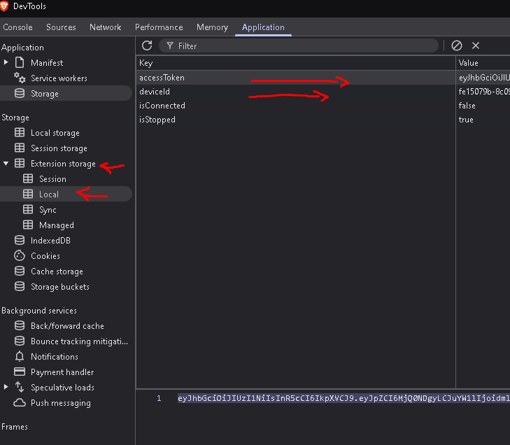

# Sparkchain Auto Bot

A WebSocket-based bot for automating Sparkchain connections with support for multiple accounts and proxy rotation.

## Registrasion

- Open Link : Sparkchain Airdrop (https://sparkchain.ai/register/?r=46786323)
- Register Via Email
- Verifikasi Email
- Click Logo Task 》Complete All Task
- Download Extension (https://chromewebstore.google.com/detail/spark-lite-node/jlpniknnodfkbmbgkjelcailjljlecch) (Use Mises or Kiwi)
- Login and Start Mining
- Done, Dont Miss

## Features

- Multiple account support
- Proxy support (HTTP, HTTPS, SOCKS4, SOCKS5)
- Automatic reconnection
- Connection status monitoring
- Ping/Pong handling

## Setup

1. Clone Repository
```bash
git clone https://github.com/airdropinsiders/Sparkchain-Auto-Bot.git
cd Sparkchain-Auto-Bot
```
2. Install dependencies:
```bash
npm install
```

2. Create `config.json` with your device ID and tokens:
```json
{
    "deviceId": "your-device-id",
    "tokens": [
        "token1",
        "token2"
    ]
}
```

3. (Optional) Create `proxies.txt` with your proxies:
```
http://username:password@ip:port
http://proxy1:port
socks5://proxy2:port
```

## How to Find Access Token & Device-Id
> **Right Click on Extension then inspect elemen.**



## Usage

Start the bot:
```bash
npm start
```

## Support

Join our Telegram channel for updates and support:
https://t.me/AirdropInsiderID

## License

MIT
